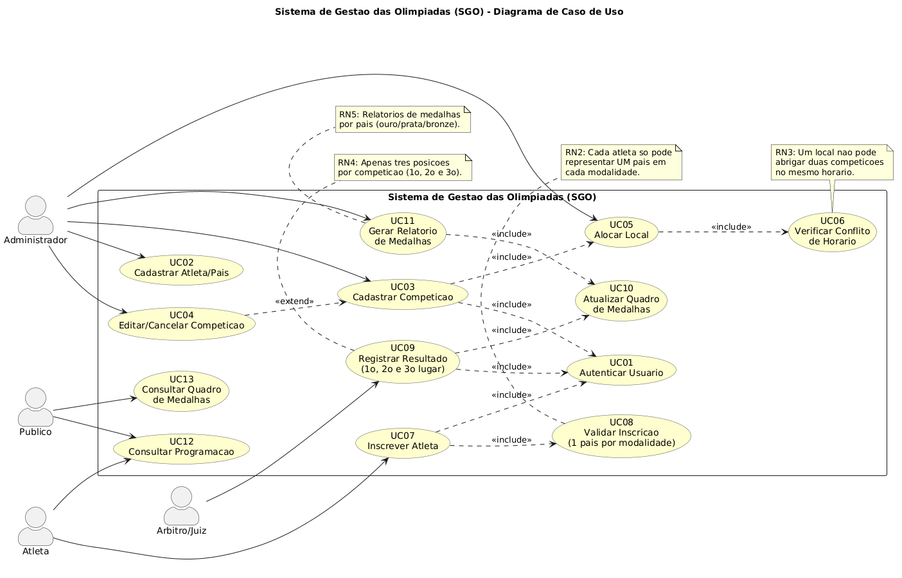
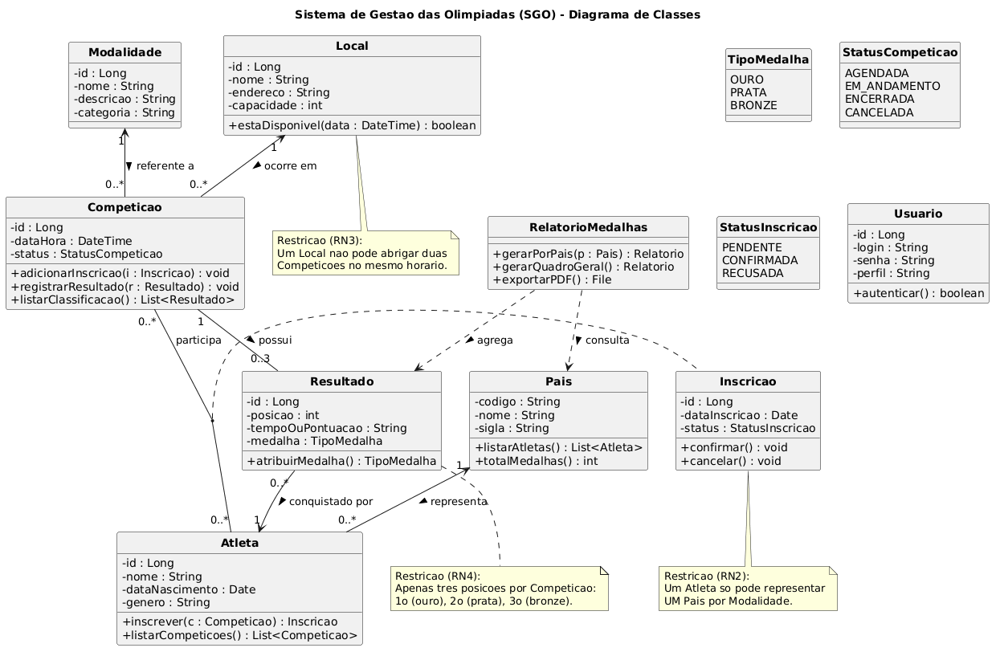
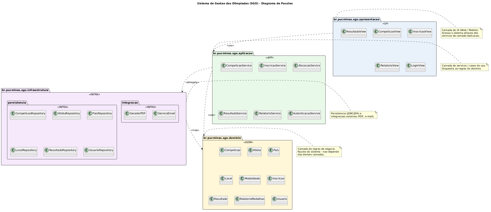
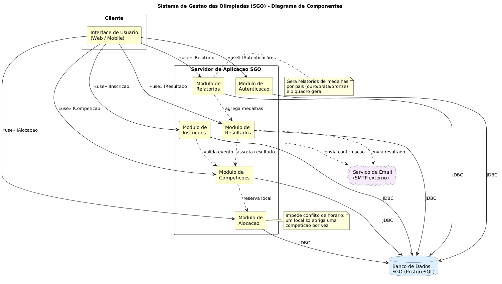
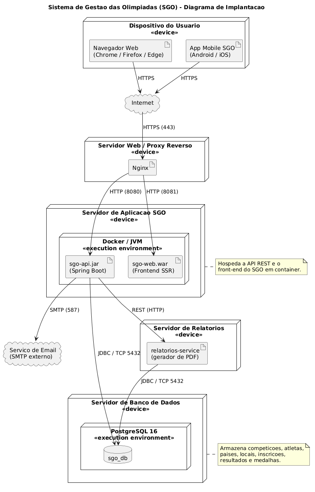

# Sistema de Gestão das Olimpíadas (SGO)

> **PUC Minas — Engenharia de Software**
> **Disciplina:** Projeto de Software (4º período)
> **Professor:** João Paulo Carneiro Aramuni
> **Trabalho 1 — Primeira Entrega — Valor: 10 pontos**
>
> **Autor:** Luiz Fernando Batista Moreira
> **Matrícula:** 869239

---

## 1. Descrição do Sistema

Com a chegada das Olimpíadas, um novo sistema de gestão é necessário para coordenar os diferentes aspectos do evento. O **Sistema de Gestão das Olimpíadas (SGO)** permite o gerenciamento de **competições**, **inscrições de atletas**, **alocação de locais** para as provas e o **controle de resultados**, gerando ainda **relatórios de medalhas** por país.

---

## 2. Regras de Negócio

1. **Cadastro de competições:** o sistema deve permitir o cadastro de competições, que incluem o nome da modalidade, data, horário, local e lista de atletas inscritos.
2. **Inscrição de atletas:** atletas de diferentes países devem se inscrever em competições específicas. Cada atleta pode participar de várias competições, mas só pode representar um país em cada modalidade.
3. **Alocação de locais:** os locais para as competições devem ser alocados de forma a evitar conflitos de horário. Um local só pode abrigar uma competição por vez.
4. **Controle de resultados:** após a realização das competições, os resultados devem ser registrados, determinando o atleta vencedor e os classificados em segundo e terceiro lugares.
5. **Relatórios de medalhas:** o sistema deve gerar relatórios de medalhas, mostrando o desempenho de cada país com base nas medalhas de ouro, prata e bronze conquistadas.

---

## 3. Histórias de Usuário

| ID    | História |
|-------|----------|
| **US01** | **Como** Administrador, **quero** cadastrar uma nova competição informando modalidade, data, horário e local, **para que** o evento seja oficialmente programado na agenda olímpica. |
| **US02** | **Como** Administrador, **quero** editar ou cancelar uma competição já cadastrada, **para que** eu possa corrigir erros ou tratar imprevistos antes da realização da prova. |
| **US03** | **Como** Administrador, **quero** alocar um local a uma competição garantindo que não haja conflito de horário com outro evento no mesmo local, **para que** a infraestrutura seja utilizada sem sobreposições. |
| **US04** | **Como** Administrador, **quero** cadastrar atletas e países participantes, **para que** eles fiquem disponíveis para inscrição nas competições. |
| **US05** | **Como** Atleta, **quero** me inscrever em uma competição representando o meu país, **para que** eu possa participar oficialmente da modalidade. |
| **US06** | **Como** Sistema, **quero** impedir que um mesmo atleta represente mais de um país em uma mesma modalidade, **para que** a regra olímpica seja respeitada. |
| **US07** | **Como** Árbitro/Juiz, **quero** registrar o resultado de uma competição informando 1º, 2º e 3º lugares, **para que** o pódio seja oficializado e as medalhas atribuídas. |
| **US08** | **Como** Administrador, **quero** gerar relatório de medalhas por país (ouro, prata e bronze), **para que** o desempenho de cada delegação seja divulgado de forma clara. |
| **US09** | **Como** Público, **quero** consultar a programação das competições, **para que** eu possa acompanhar dias, horários e locais dos eventos. |
| **US10** | **Como** Público, **quero** consultar o quadro geral de medalhas, **para que** eu acompanhe em tempo real o desempenho dos países participantes. |
| **US11** | **Como** Atleta, **quero** visualizar minhas inscrições confirmadas e meus resultados, **para que** eu acompanhe minha participação nos jogos. |
| **US12** | **Como** Usuário do sistema, **quero** autenticar-me com login e senha, **para que** apenas perfis autorizados acessem funcionalidades restritas (cadastros, alocações e resultados). |

---

## 4. Diagramas UML

Todos os diagramas foram modelados em **PlantUML**. Os arquivos-fonte estão em [`codigos/`](codigos/) e as imagens geradas em [`imagens/`](imagens/).

### 4.1 Diagrama de Caso de Uso

Modela os atores (**Administrador**, **Atleta**, **Árbitro/Juiz** e **Público**) e os casos de uso principais — incluindo *Cadastrar Competição*, *Alocar Local*, *Inscrever Atleta*, *Registrar Resultado* e *Gerar Relatório de Medalhas* — com relações `<<include>>` e `<<extend>>` cobrindo as regras de negócio.



> Código-fonte: [`codigos/diagrama-de-caso-de-uso.puml`](codigos/diagrama-de-caso-de-uso.puml)

---

### 4.2 Diagrama de Classes

Representa a estrutura estática do domínio, com as classes **Competição**, **Atleta**, **País**, **Local**, **Modalidade**, **Inscrição** (classe associativa entre Atleta e Competição), **Resultado**, **RelatórioMedalhas** e **Usuário**, além dos enums `TipoMedalha`, `StatusCompeticao` e `StatusInscricao`. As restrições de regra de negócio (1 país por modalidade, sem conflito de horário e três posições por competição) estão registradas em notas UML.



> Código-fonte: [`codigos/diagrama-de-classes.puml`](codigos/diagrama-de-classes.puml)

---

### 4.3 Diagrama de Pacotes

Organiza o sistema em **quatro camadas** seguindo o estilo de arquitetura em camadas:

- `br.pucminas.sgo.apresentacao` — interfaces de usuário (views).
- `br.pucminas.sgo.aplicacao` — serviços/controllers (regras de aplicação).
- `br.pucminas.sgo.dominio` — entidades e regras de negócio.
- `br.pucminas.sgo.infraestrutura` — repositórios de persistência e integrações externas.



> Código-fonte: [`codigos/diagrama-de-pacotes.puml`](codigos/diagrama-de-pacotes.puml)

---

### 4.4 Diagrama de Componentes

Modela os componentes principais do sistema — **Interface de Usuário**, **Módulo de Autenticação**, **Módulo de Competições**, **Módulo de Inscrições**, **Módulo de Alocação**, **Módulo de Resultados** e **Módulo de Relatórios** — com as interfaces fornecidas/requeridas e as conexões com o banco de dados e o serviço de e-mail.



> Código-fonte: [`codigos/diagrama-de-componentes.puml`](codigos/diagrama-de-componentes.puml)

---

### 4.5 Diagrama de Implantação

Ilustra a arquitetura física do SGO: **dispositivos dos usuários** (navegador web e app mobile), **servidor web/proxy reverso (Nginx)**, **servidor de aplicação** (contêiner Docker com a API Spring Boot e o front-end), **servidor de banco de dados PostgreSQL**, **servidor de relatórios** e o **serviço de e-mail externo**, com os respectivos protocolos de comunicação.



> Código-fonte: [`codigos/diagrama-de-implantacao.puml`](codigos/diagrama-de-implantacao.puml)

---

## 5. Estrutura do Repositório

```
Trabalho-SGO/
├── README.md
├── Trabalho - SGO - 10 pontos-1 (2).pdf
├── imagens/
│   ├── diagrama-de-caso-de-uso.png
│   ├── diagrama-de-classes.png
│   ├── diagrama-de-pacotes.png
│   ├── diagrama-de-componentes.png
│   └── diagrama-de-implantacao.png
└── codigos/
    ├── diagrama-de-caso-de-uso.puml
    ├── diagrama-de-classes.puml
    ├── diagrama-de-pacotes.puml
    ├── diagrama-de-componentes.puml
    └── diagrama-de-implantacao.puml
```

---

## 6. Tecnologias Utilizadas

- **[PlantUML](https://plantuml.com/)** — linguagem para modelagem dos diagramas UML.
- **[PlantUML Web Server](https://www.plantuml.com/plantuml/)** — utilizado para renderização das imagens PNG a partir dos arquivos `.puml`.

---

## 7. Como Regerar as Imagens

A forma mais simples é colar o conteúdo de cada arquivo `.puml` no editor online oficial:

- https://www.plantuml.com/plantuml/uml/

Alternativas:

- **Extensão PlantUML do VSCode** (`Alt + D` para preview e `Ctrl + Shift + P → PlantUML: Export Current Diagram`).
- **CLI local** (requer Java): `java -jar plantuml.jar codigos/*.puml -o ../imagens`.

---

## 8. Referências

- Enunciado do trabalho: `Trabalho - SGO - 10 pontos-1 (2).pdf` (incluso no repositório).
- PlantUML — Guia oficial: https://plantuml.com/guide
- PlantUML API (projeto referência do professor): https://github.com/joaopauloaramuni/projeto-de-software/tree/main/PROJETOS/Python/Projeto%20PlantUML%20API
